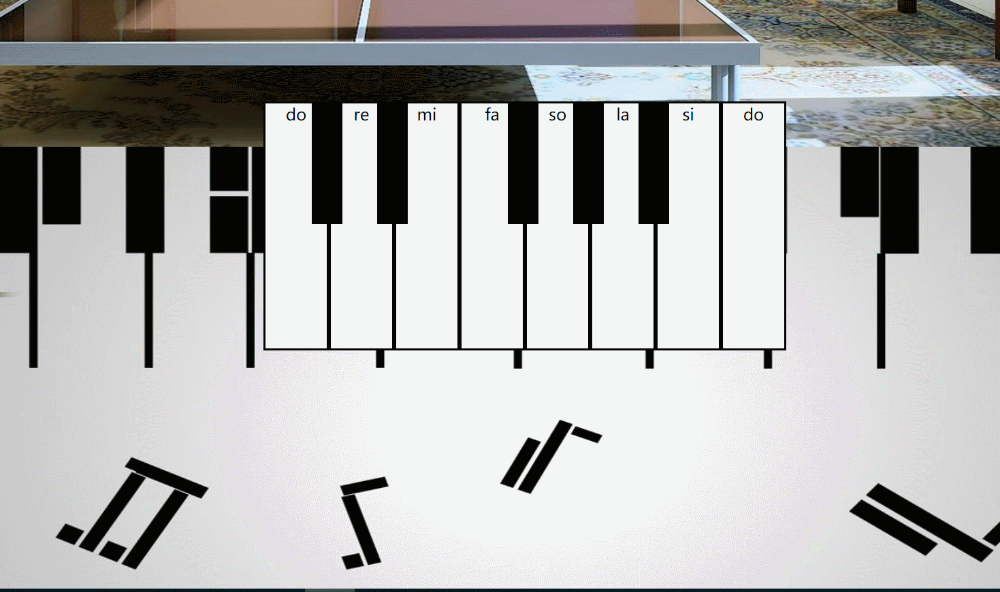

# 钢琴小demo

 ### 效果图如下：
 
 
 ### html代码
 ```angular2html
<!DOCTYPE html>
<html lang="en">
<head>
    <meta charset="UTF-8">
    <title>钢琴</title>
    <link rel="stylesheet" href="css/index.css">
</head>
<body>
<video class="piano_video" src="assets/mp3/gangqin~1.webm" autoplay="autoplay"></video>
<div id="btn_play">play</div>
<div class="whole">
    <ul class="piano_key">
        <li>
            do
            <div></div>
            
            <audio src="assets/mp3/1do.mp3"></audio>
        </li>
        <li>
            re
            <div></div>
            
            <audio src="assets/mp3/2re.mp3"></audio>
        </li>
        <li>
            mi
            
            <audio src="assets/mp3/3mi.mp3"></audio>
        </li>
        <li>
            fa
            <div></div>
            
            <audio src="assets/mp3/4fa.mp3"></audio>
        </li>
        <li>
            so
            <div></div>
            
            <audio src="assets/mp3/5so.mp3"></audio>
        </li>
        <li>
            la
            <div></div>
            
            <audio src="assets/mp3/6la.mp3"></audio>
        </li>
        <li>
            si
            
            <audio src="assets/mp3/7si.mp3"></audio>
        </li>
        <li>
            do
            
            <audio src="assets/mp3/8do.mp3"></audio>
        </li>
    </ul>
</div>
<script src="js/jquery-3.3.1.js"></script>
<script src="js/index.js"></script>
</body>
</html>
```
 ###  css代码 
 ```angular2html
*{
    margin: 0;
    padding: 0;
}
.piano_video{
    width: 100%;
    height: 100%;
    position: relative;
    z-index: 2;
}
#btn_play{
    position: absolute;
    bottom: 50px;
    right: 50px;
    z-index: 3;
    width: 80px;
    height: 80px;
    border-radius: 50%;
    color:white;
    border:2px solid white;
    text-align: center;
    line-height: 80px;
    font-size: 24px;
    cursor: pointer;
}
.whole{
    width: 100%;
    height: 100%;
    position: absolute;
    top: 0;
    left: 0;
    background: url("../assets/img/timg2.jpg");
    background-size: 100% 100%;
}
.whole>.piano_key{
    list-style: none;
    width: 512px;
    height: 244px;
    margin:100px auto 0;
}
.whole>.piano_key>li{
    float: left;
    width: 60px;
    height: 240px;
    border:2px solid #000000;
    background:#ffffff;
    text-align: center;
    position: relative;
}
.whole>.piano_key>li>img{
    position: absolute;
    top: 400px;
    left: 0;
    width: 60px;
    opacity: 0;
}
.whole>.piano_key>li>div{
    width:30px;
    height: 120px;
    background: black;
    position: absolute;
    top: -2px;
    right: -15px;
    z-index: 1;
}
.li_mousedown{
    box-shadow: yellowgreen 0px 0px 10px 3px inset;
}
.whole>.piano_key>li>img.current{
    top: -200px;
    transition: all 6s;
}
.whole>.piano_key>li>img.opcaity1{
    opacity: 1;
}
```
### javascript代码
```angular2html
'use strict';
$(function () {
   $("#btn_play").click(function () {
       /**
        * 点击按钮后隐藏视频和按钮本身
        * @type {jQuery.fn.init|jQuery|HTMLElement}
        * @private
        */
       var _t = $(this);
       $("video").fadeOut(1500,function () {
       }).get(0).pause();
       _t.fadeOut(1500);
   });
    $(".piano_key>li").click(function () {
        var _t = $(this);
        _t.children("audio").get(0).play();
        if(_t.children("img").hasClass("current")){
            _t.children("img").removeClass("opcaity1 current");
        }else {
            _t.children("img").addClass("opcaity1 current");
        }
    });
    $(".piano_key>li").mousedown(function () {
        $(this).addClass("li_mousedown");
    }).mouseup(function () {
        $(this).removeClass("li_mousedown");
    });
    /**
     *
     * @param keyCode Number
     * @param isKeydown  Boolean
     */
    function pianoVoice(keyCode,isKeydown){
        switch (keyCode) {
            //键盘1键
            case 49:
            //键盘2键
            case 50:
            //键盘3键
            case 51:
            //键盘4键
            case 52:
            //键盘5键
            case 53:
            //键盘6键
            case 54:
            //键盘7键
            case 55:
            //键盘8键
            case 56:
                var _li = $(".piano_key>li").eq(keyCode-49);
                if(isKeydown){
                    _li.addClass("li_mousedown")
                        .children("audio").get(0).play();
                    if(_li.children("img").hasClass("current")){
                        _li.children("img").removeClass("opcaity1 current");
                    }else {
                        _li.children("img").addClass("opcaity1 current");
                    }
                }else {
                    _li.removeClass("li_mousedown")
                        .children("audio").get(0).pause();
                    _li.children("audio").get(0).load();
                }
                break;
        }
    }
    $(document).keydown(function (event) {
        pianoVoice(event.keyCode,true);
    });
    $(document).keyup(function (event) {
        pianoVoice(event.keyCode,false);
    })
});
```
